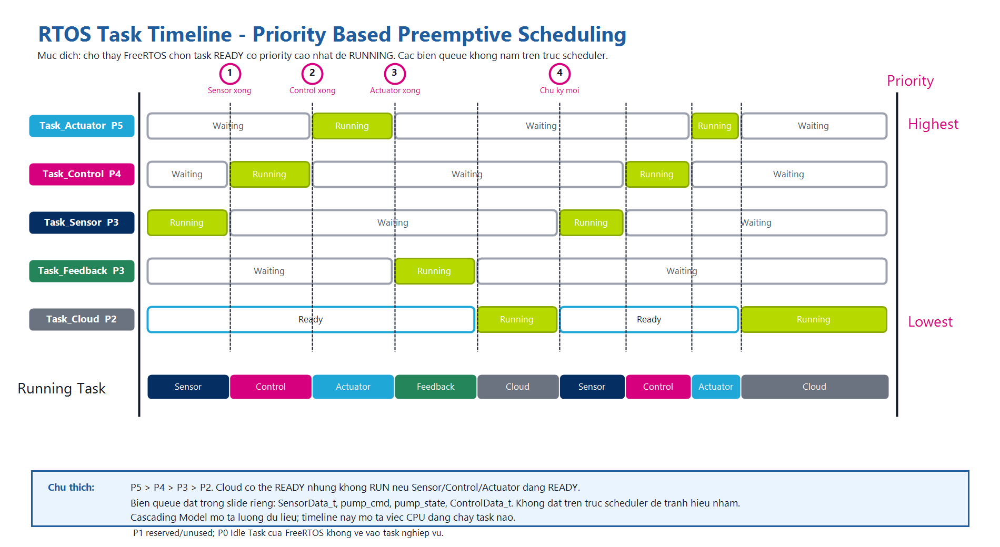

# Bảng schedule RTOS

Ảnh timeline dùng cho slide:



Mục đích:

```text
Ảnh timeline dùng để giải thích FreeRTOS Scheduler chọn task nào chạy trên CPU.
Ảnh này không mô tả công thức GDD/CGDD và không mô tả nội dung bên trong struct.
Biến truyền giữa task phải đọc ở bảng Queue/Semaphore, không đặt lên trục scheduler.
```

---

# 1. Cách đọc timeline

| Thành phần | Vị trí | Vai trò |
|---|---|---|
| Danh sách task | Bên trái | Mỗi hàng là một task FreeRTOS |
| Priority | Bên phải | Cho biết task nào quan trọng hơn khi nhiều task cùng READY |
| Trục thời gian | Ngang từ trái sang phải | Cho biết trạng thái task thay đổi theo thời gian |
| Waiting | Trong hàng task | Task đang chờ queue, delay hoặc chu kỳ mới |
| Ready | Trong hàng task | Task đã sẵn sàng nhưng chưa được CPU chạy |
| Running | Trong hàng task | Task đang chạy trên CPU |
| Running Task | Hàng dưới cùng | Tóm tắt CPU đang chạy task nào ở từng đoạn |
| Time slice | Đoạn chia nhỏ thời gian | Dùng khi nhiều task cùng priority cùng READY |

---

# 2. Priority trên timeline

| Priority | Task | Giải thích |
|---:|---|---|
| P5 | Task_Actuator | Cao nhất vì bật/tắt bơm phải phản ứng nhanh |
| P4 | Task_Control | Quyết định tưới và tạo pump_cmd |
| P3 | Task_Sensor | Đọc cảm biến và tạo SensorData_t |
| P3 | Task_Feedback | Đo phản hồi sau tưới |
| P2 | Task_Cloud | Telemetry không được làm chậm điều khiển |
| P1 | Chưa dùng | Dự phòng cho background/log nếu sau này cần |
| P0 | Idle Task | Task nền của FreeRTOS, không phải task nghiệp vụ |

Ghi chú:

```text
Số priority lớn hơn nghĩa là ưu tiên cao hơn.
P0 là Idle Task của FreeRTOS.
P1 không phải quy định bắt buộc của FreeRTOS; đây chỉ là mức ứng dụng đang để trống.
```

---

# 3. Timeline nghiệp vụ

| Mốc | Task chạy logic | Công việc chính | Dữ liệu ra | Gửi tới |
|---|---|---|---|---|
| t0 | Task_Sensor | Đọc DHT22 + Soil sensor, kiểm tra lỗi | SensorData_t | Task_Control, Task_Cloud |
| t1 | Task_Control | Tính GDD/CGDD, chọn stage, tính WATER_DURATION_MS | pump_cmd, ControlData_t | Task_Actuator, Task_Cloud |
| t2 | Task_Actuator | Nhận pump_cmd, điều khiển GPIO/AO3400/relay | pump_state | Task_Feedback |
| t3 | Task_Feedback | Chờ đất ổn định, đo lại H_soil | SensorData_t phản hồi | Task_Control, Task_Cloud |
| t4 | Task_Cloud | Tạo TelemetryPacket_t và publish MQTT | TelemetryPacket_t | ThingsBoard/Server |

Ghi chú:

```text
Bảng này là thứ tự nghiệp vụ để thuyết trình.
Scheduler thực tế vẫn chạy theo priority.
Nếu Task_Actuator READY trong lúc Task_Cloud đang chạy, Task_Actuator được ưu tiên chạy trước.
```

---

# 4. Bảng Queue / Semaphore

| Nguồn | Đích | Cơ chế | Dữ liệu / mục đích |
|---|---|---|---|
| Task_Sensor | Task_Control | Queue | SensorData_t |
| Task_Control | Task_Actuator | Queue | pump_cmd |
| Task_Actuator | Task_Feedback | Queue | pump_state |
| Task_Control | Task_Cloud | Queue | ControlData_t |
| Task_Sensor / Task_Feedback | Task_Cloud | Queue hoặc shared latest buffer | SensorData_t mới nhất theo timestamp |
| Shared latest buffer | Task liên quan | Mutex/Semaphore | Bảo vệ vùng dữ liệu dùng chung nếu có |
| ISR/event nội bộ | Task liên quan | Semaphore | Báo hiệu sự kiện, không truyền struct |

Quy tắc:

```text
Queue dùng để truyền dữ liệu.
Semaphore dùng để báo hiệu.
Mutex dùng để bảo vệ vùng dữ liệu dùng chung.
TelemetryPacket_t do Task_Cloud tạo để publish MQTT, không phải queue nội bộ bắt buộc.
```

---

# 5. Câu nói ngắn khi thuyết trình

```text
Timeline này cho thấy FreeRTOS chọn task nào chạy trên CPU.
Mỗi hàng là một task, bên phải là priority.
Task có ba trạng thái chính: Waiting, Ready và Running.
Scheduler luôn chọn task Ready có priority cao nhất.
Vì vậy Task_Actuator và Task_Control được ưu tiên hơn Task_Cloud.
Dữ liệu giữa task đi qua Queue; timeline chỉ cho thấy CPU đang chạy task nào.
```

