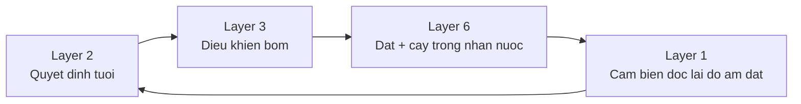

# Layer 6. Flowchart - Tang doi tuong dieu khien Dat + cay trong

```mermaid
flowchart TB
    HEADER["[Layer 6. Soil + Crop Object Layer]<br/>Doi tuong: Dat vung re + cay trong<br/>Cong viec: Nhan nuoc tuoi, cap nhat do am dat vung re va tao phan hoi vat ly<br/>Input: pump_cmd, pump_state, watering_duration, H_soil_before, T_air, H_air, current_stage, timestamp<br/>Output: H_soil_after, soil_response_status, crop_water_status, SoilObjectData_t"]

    TITLE["Layer 6. Controlled Object Layer<br/>Soil + Crop<br/>Input: pump_cmd, pump_state, watering_duration, H_soil_before<br/>Output: H_soil_after, SoilObjectData_t"]

    S1["1. Tang nhan tac dong tuoi<br/>Doi tuong: Dat vung re + cay trong<br/>Cong viec: Nhan trang thai bom va thoi gian tuoi tu Layer 3<br/>Bien vao: pump_cmd, pump_state, watering_duration, timestamp<br/>Bien ra: watering_event<br/>Giai thich: Neu bom duoc bat trong thoi gian hop le thi dat + cay ghi nhan co su kien cap nuoc"]

    S2["2. Tang tinh luong nuoc vao dat<br/>Doi tuong: Dat vung re<br/>Cong viec: Uoc tinh luong nuoc dua vao dat theo thoi gian bom chay<br/>Bien dung: watering_duration, PUMP_FLOW_RATE, water_input<br/>Bien ra: water_input<br/>Giai thich: Thoi gian bom cang dai thi luong nuoc vao dat cang lon"]

    S3["3. Tang hap thu va tham nuoc vung re<br/>Doi tuong: Dat + vung re cay<br/>Cong viec: Tinh phan nuoc duoc dat giu lai va cay co the su dung<br/>Bien dung: water_input, H_soil_before, current_stage, ROOT_ZONE_CAPACITY<br/>Bien ra: water_absorbed, root_zone_moisture<br/>Giai thich: Dat kho hap thu nuoc manh hon dat da am; giai doan cay anh huong nhu cau giu am"]

    S4["4. Tang cap nhat do am dat vung re<br/>Doi tuong: Dat vung re<br/>Cong viec: Cap nhat do am dat sau khi nhan nuoc tuoi<br/>Bien dung: H_soil_before, water_absorbed, ROOT_ZONE_CAPACITY<br/>Bien ra: H_soil_after<br/>Giai thich: H_soil_after duoc gioi han trong khoang 0-100% de phu hop voi chuan hoa cua Layer 1"]

    S5["5. Tang tinh mat nuoc tu dat va cay<br/>Doi tuong: Dat + cay trong<br/>Cong viec: Uoc tinh mat nuoc do bay hoi, thoat hoi va nhu cau nuoc cua cay<br/>Bien dung: T_air, H_air, current_stage, water_loss<br/>Bien ra: water_loss, root_zone_moisture<br/>Giai thich: Nhiet do cao va do am khong khi thap lam mat nuoc nhanh hon"]

    S6["6. Tang danh gia trang thai dat sau tuoi<br/>Doi tuong: Dat vung re<br/>Cong viec: Phan loai trang thai dat dua tren H_soil_after<br/>Bien dung: H_soil_after, current_stage<br/>Bien ra: soil_response_status<br/>Giai thich: Trang thai gom Too Wet, Adequate, Slightly Dry, Dry, Very Dry"]

    S7["7. Tang danh gia trang thai nuoc cua cay<br/>Doi tuong: Cay trong<br/>Cong viec: Danh gia cay du nuoc, thieu nuoc hay co nguy co ung re<br/>Bien dung: H_soil_after, soil_response_status, current_stage<br/>Bien ra: crop_water_status<br/>Giai thich: Cay khong nhan lenh truc tiep; cay phan ung theo do am dat quanh re"]

    S8["8. Dong goi SoilObjectData_t<br/>Doi tuong: Soil + Crop Object Layer<br/>Cong viec: Tao goi du lieu phan hoi cua dat va cay sau tac dong tuoi<br/>Bien vao: H_soil_before, H_soil_after, water_input, water_absorbed, water_loss, soil_response_status, crop_water_status, timestamp<br/>Bien ra: SoilObjectData_t<br/>Giai thich: Goi du lieu dung de log, hien thi dashboard hoac doi chieu voi lan doc cam bien tiep theo"]

    FEEDBACK["Phan hoi ve Layer 1<br/>Layer 1 doc lai H_soil_after o chu ky tiep theo<br/>Gia tri do moi tao vong phan hoi cho Layer 2 quyet dinh tuoi tiep"]

    HEADER --> TITLE
    TITLE --> S1
    S1 --> S2
    S2 --> S3
    S3 --> S4
    S4 --> S5
    S5 --> S6
    S6 --> S7
    S7 --> S8
    S8 --> FEEDBACK
```



## SoilObjectData_t

```cpp
struct SoilObjectData_t {
  float H_soil_before;
  float H_soil_after;
  float root_zone_moisture;
  float water_input;
  float water_absorbed;
  float water_loss;
  const char* soil_response_status;
  const char* crop_water_status;
  unsigned long timestamp;
};
```

## Ghi chu lien ket tang


